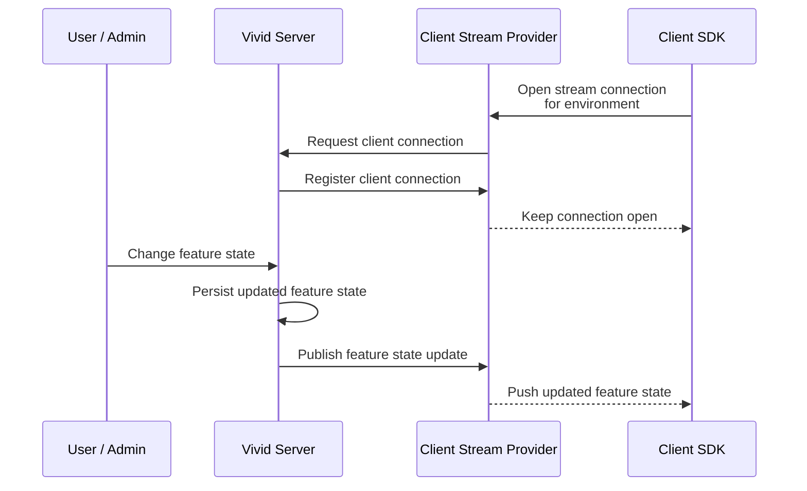

import Tabs from '@theme/Tabs';
import TabItem from '@theme/TabItem';

# Client Streams

Vivids client SDKs will fetch feature states on demand.
If the local cache does not contain a feature you're requesting, Vivid will attempt to fetch it from the server.
This is called "pull".

Its an easy way to get started, but is not the most efficient way to use Vivid.
As caches are not invalidated often, you'll be using the same feature state over a long period of time.
Only once the cache is invalidated, will the server be queried again.
This can lead to delays in the reaction time of your application.
You click the button, but it takes hours until your Client behaves differently.

## Polling

The first line of defense against this is baked into the client SDKs.
You can configure your SDK to refresh the cache periodically by fetching the latest feature states.
This is called "polling".

In your spring client, you'll need to add "rest" as a stream provider:

```properties
spring.vivid.streams=rest
```

Additionally, you can set these properties to further configure the polling:

```properties title=application.properties
spring.vivid.rest.polling.enabled=true       # Enables your client to poll from vivid
spring.vivid.rest.polling.interval=PT1H      # Polls every hour
spring.vivid.rest.polling.poll-type=refresh  # Either poll only for known features (refresh) or fetch all features from the environment (all)
```

Polling is a good way to get started, but it's not the most efficient way to use Vivid.
You'd want to set the interval as low as possible to get the fastest reaction time when a client changes, but the lower the value, the more requests you'll be sending to the server.
And more requests means more load.

## Streaming

To mitigate this problem, Vivid can be configured to push feature states to your client.
This is called "streaming".

Generally, with streaming enabled, the client keeps an open connection to Vivid.
Whenever a feature state changes, Vivid publishes the update through a configured stream provider.
The client SDK receives the update and refreshes its local cache, so your application can react without waiting for the next polling interval.



Streaming is a powerful tool to make your applications react in real time to changes in the frontend, but needs to be enabled explicitly.
Both the Vivid Backend and the Client need to enable a streaming provider.
To do so, you'll need to enable which streaming providers you want to start with Vivid.
Currently supported providers are:

### Server-Sent-Events (SSE)

You can use SSE to push feature states to your clients.

In Vivid, you'll need to configure the stream provider by setting the following properties:

<Tabs>
  <TabItem value="backend" label="Vivid Backend" default>
```properties
vivid.clients.streams.sse.enabled=true
```
  </TabItem>
  <TabItem value="client" label="Client">
```properties
spring.vivid.streams=sse
```
  </TabItem>
</Tabs>

---
